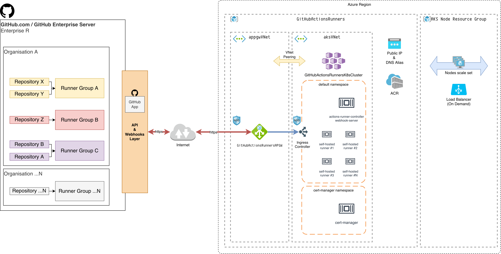

# Adopting GitHub Actions at scale in the Enterprise
## Reference Architecture

- Summary
  - Organization
    - One or more Repository
      - One or more Workflows
        - Workflows will need self hosted runners to execute the job
      - API and Webhook layer to register or Deregister the jobs on the right runners
  - Trafic from API Layer -> Internet -> APGW -> Ingress Controller->