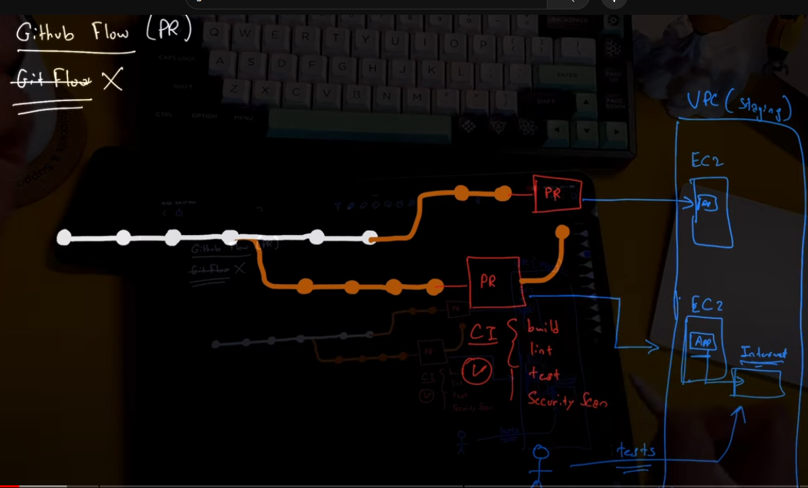

# Continous Deployment with GitHub Actions

## Fundamentals

- Dependency of CD
  - Software Architecture
  - Infrastructure
    - Cloud
    - On-Premises
    - Devices
  - Skill Level/Maturity of the team
  - Type of product that we are building
    - SAAS
    - Mobile App
    - Firmware
    - IAC
    - Strategy
      - Blue/Green
        - Saves you from downtime
      - Canary
        - Very Costly , % Clients deployments
    - Branching
      - Github Flow
        - PR flow
        - Try to keep it simple as possible
      - Git Flow
        - Not recommended
        - They live on long lived branches and it is not very good to have long lived branches
        - Lot of maintenance

## Assumptions

- Monolith build
- Deploying to the cloud
  - AWS
    - VPC
    - EC2
- Beginner level
- SAAS website/ Rest API
- Environments
  - Dev,Staging,Production
- Strategy
  - Accept a downtime
- Branching
  - GitHub Flow

## Branching Strategy

- Github Flow
  - 
  - The white line represents the main line. And the orange represents the feature line.
  - Say the feature shown at the bottom is PR1 and feature shown at the top is PR2.
  - When PR1 makes a PR then the CI we learnt in the last chapter runs
  - When the CI is passed the app is deployed to a staging environment and users and dev can test the PR
  - Now is PR2 also creates a PR , and if the CI is passed the staging environment would be rewritten. To avoid this we could have a another instance to which is deployed. In other words every PR has an Instance in the staging environment to test the code individually.
  - Once the PR is complete the Instances in Staging eg and EC2 instance is destroyed.
  - Now if PR1 is merged 1st to the main, CI checks will be run which will include and check for any conflits that comes with point 5,6 in white main line.
  - Same thing goes when PR2 is merged . with will check CI again which will inturn check if the PR1 merged to main has any conflits with PR2. If all is good then PR2 is merged to main.
  - The next step is Continuous Deployment

## Continuous Deployment  

- Once the PR is merged we must deploy the newly merged feature on main to Production. This can be done in many ways like a direct Deployment of main to Production everytime there is a merge
- Or we could do and this is what we will try to achieve in this lesson
  - Create a manual trigger and create commit hash for this
  - Once Triggered the deployment take main with the newly merged feature and deploys to production. 
- Here we could deploy to new Instance like EC2 in Production while existing keeps serving the users to avoid any downtime .Which is Blue Green Deployment
- This is the essence of CD

  -g
