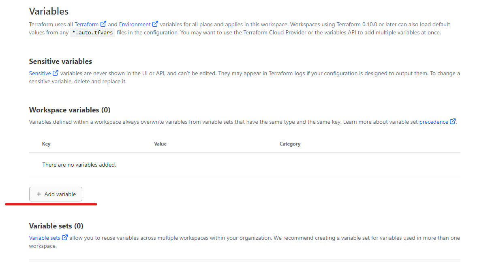

# Basic concepts of IAC

## Past


- Internet is just a graph of nodes connected together
- Cloud is not very different from On-Premises because Cloud is just renting someone elses hardware
  
## Cloud


- Let us see from Outside to Inside
- Devices connect to ISP which connects to the backbone of internet
- From Internet you reach the Cloud/Pvt Cloud/ VPC - Virtual Private cloud /Vnet - These just hosts different services and an abstraction.
- Inside this cloud you will start with Gateway - Gateway is an entry point for traffic/requests etc. The gate helps in traffic control
  - VPC peerting/Vnt Peering
  - Nat
- Then you have NACL - Network access control layer - FW, NSG etc
- NLB,ALB - Network Load balancer, Application Load balancer etc
- Subnets - Private Subnets, Public Subnet etc
- VMs, Dbs etc.
- See how a Public Subnet which needs access to a data in Private Database is given access
- Cloud Providers also provide us other services which does not sit in your Vnet like Blob Storage, Event Bridge or Lamda, Entra ID, IAM etc they are integrated deeply in your Vnet but not inside it .
- You need to follow the correct design Principles else it easy to leave a hole which attackers can use to hack.

## IAC

-Cloud Provider provisions

- Console UI - All Cloud providers will give u a dashboard / Portal where you can setup things manually.
- CLI/ API - you can use this for automation and scripts and also if u like terminal.
- SDK/CDK - Software/ Cloud development kit - Instead of using bath script you can leverage other softwares like Python, Powershell etc to manage the Cloud. This is already a step up.
- Template Tools - Using structures like Json or Yaml we can define a complex infrastructures and this is powerful if we can define and infra in such a code and get it deployed. This is basic of IAC
  
## Terraform


- Practitioner - You and me
- Infrastructure as Code - The configuration / Template of the infrastructure
- Plan - It takes the template , Compares with live state and if there is a drift it will show what will change
- Apply - It will apply the template and make the change on the infrastructure and makes sure it matches the template.
- It is cloud provider Agnotic , meaning its syntax will work on multiple cloud provider . Ofcourse you need to know the cloud you are dealing with.
- Terraform can be also used with things like Github
- It is a statefull Resource management tool
- It uses HCL which is a domain specific language which give us some control and semi declarative language
- Terraform Locally
  - main.tf
  - variables.tfvars to pass variable
  - vars.tf for variables
  - .terraform.lock.hcl - This locks the providers that we are using , Sometimes in upgrade we see there is breaking change . To avoid this file locks the providers used for the deployment and it uses them all the time.
  - [Repository](https://github.com/KiranChilledOut/iac-testing)
  - [Terraform AWS](https://registry.terraform.io/providers/hashicorp/aws/latest/docs)

## Steps to follow (Local)

- from the CD documentation you would have created a AWS account, and a user and also have an access key for this user.
- Create a new Repo or follow the Repo mentioned above in this file
  
### main.tf
- Create `main.tf` file 

```terraform
terraform {
  required_providers {
    aws = {
      source  = "hashicorp/aws"
      version = "~> 5.0"
    }
  }
}

# Configure the AWS Provider
provider "aws" {
  region = "eu-west-1"
}

```
- For above block you can see the Terraform AWS docs
- Next to get the list of AMI use the below command
```powershell
$images=aws ec2 describe-images --region eu-west-1
$images_json = $images | ConvertFrom-Json
$testJson.Images`
|where { 
  $_.Name -match "^Ubuntu/" -and `
  $_.Name -match "AMD" -and `
  $_.Name -match "64" -and `
  $_.Name -match "focal" -and `
  $_.Name -match "hvm-ssd" -and `
  $_.OwnerId -eq "099720109477"
  }`
  |Select Name,OwnerId
```

- This explains the below block of terraform in the main.tf .For SSH anf HTTPs allow
 ```terraform
resource "aws_security_group" "this" {
  description = "ssh and https"
  egress = [{
    cidr_blocks      = ["0.0.0.0/0"]
    description      = ""
    from_port        = 0
    ipv6_cidr_blocks = []
    prefix_list_ids  = []
    protocol         = "-1"
    security_groups  = []
    self             = false
    to_port          = 0
  }]
  ingress = [{
    cidr_blocks      = ["0.0.0.0/0"]
    description      = ""
    from_port        = 22
    ipv6_cidr_blocks = []
    prefix_list_ids  = []
    protocol         = "tcp"
    security_groups  = []
    self             = false
    to_port          = 22
    }, {
    cidr_blocks      = ["0.0.0.0/0"]
    description      = ""
    from_port        = 443
    ipv6_cidr_blocks = []
    prefix_list_ids  = []
    protocol         = "tcp"
    security_groups  = []
    self             = false
    to_port          = 443
  }]
  name                   = "ssh-https"
  name_prefix            = null
  revoke_rules_on_delete = null
  tags                   = {}
  tags_all               = {}
  vpc_id                 = "vpc-01c0cd4d7700ba67f"
}

```
- Next block is creating a public key , you will use the private key later which you know to authenticate to AWS with the Private and Public key pair.
```terraform
resource "aws_key_pair" "sample_key" {
  key_name   = "sample-key"
  public_key = var.sample_public_key

  tags = {
    "Name" = "sample_public_key"
  }
}
```
- Creating the Public Private Key pair
```powershell
ssh-keygen -t rsa -b 4096 -C "ubuntu@sample-server" -f C:\.ssh\id_sample_server
```
- Then we add the resource to create the VM itself.Note how we are referencing the key_name and ami specified in previous block.

```terraform
resource "aws_instance" "this" {
  ami                           = "ami-0c1c30571d2dae5c9"
  associate_public_ip_address   = true
  instance_type                 = "t2.micro"
  key_name                      = aws_key_pair.sample_key.key_name
  vpc_security_group_ids        = [aws_security_group.this.id]
}

```
- Finally the output block to know the public dns of the ec2 instance
```terraform
output "sample_server_dns" {
  value = aws_instance.sample_server.public_dns
}
```

### vars.tf

- Create the variable that will be passed to the main.tf in our case
```terraform
variable "region" {
  default = "eu-west-1"
  type = string
}
variable "sample_public_key" {
  description = "Same environment public key value"
  type = string
}

```

### tfvars.tf
Add the created public key here . This need not be secure since its public key
`sample_public_key = "" `

### All Ready lets start terraforming inside Docker
- Spin a docker container to run terraform
```powershell
docker run -tid ubuntu:latest bash
```
- run below to see your container name
```powershell
docker ps
```


- bash into the container
```powershell
docker exec -ti youthful_galois9 bash
```
-Install AWS Plugin

```bash
apt-get update
apt-get upgrade
apt-get install wget,curl,unzip,openssh-client

curl "https://awscli.amazonaws.com/awscli-exe-linux-x86_64.zip" -o "awscliv2.zip"
unzip awscliv2.zip
sudo ./aws/install
```
  - If everything worked correct you will get an output for the below commands inside the container
```bash
aws --version
```
- Install Terraform by going to the [Linux tab](https://developer.hashicorp.com/terraform/tutorials/aws-get-started/install-cli) and following all steps
- If everything went well then you will be able to type and below and see an output of the version
```terraform
terraform --version
```
- Create a User on AWS and generate the access key 
  - Login to AWS via Browser
  - From services goto `IAM`
  - Click on the user or create a new User and go to the Security Credential Link
  - Got to Access keys and click `Create Access Key`
  - Take note of the Access Key ID and Secret Access Key displayed. It's important to copy the Secret Access Key immediately as it won't be shown again.

- Configue it in your docker container and when prompted for access key id and secret , enter it along with default aws region closer to you.
```bash
aws configure
```

- Now you are ready to deploy the ec2 instance to aws
```terraform
terraform init
terraform validate
terraform plan -var-file=main.tfvars
terraform apply -var-file=main.tfvars
```

- Congratulations you would have created an EC2 instance by now.

### Using the EC2 instance created

- Copy the SSH Private key to container. Since the Container was created by the Public Key you generated using step `Creating the Public Private Key pair`. You must use the private key to login so copy it to the container with the below command on your local terminal .
```bash
   # You must create the .ssh directory if it does not exist in container if required using the below
 mkdir -p ~/.ssh #must be run on terminal
```
```powershell
   # docker cp <pathOfPrivateKey> ContainerName:/root/.ssh/
 docker cp C:\.ssh\issampleserver\id_sample_server youthful_galois9:/root/.ssh/
```

- Back to docker terminal and you will see the private key there.
- run the below command to set the right access permissions
```bash
cd ~/.ssh/ 
chown root:root id_sample_server
chmod 600 ~/.ssh/id_rsa
```
- Now from the IAC repo inside your bash terminal use the below command to get the fqdn name of the ec2
```bash
 terraform output
 ```
- Login to the EC2 instance created 
```bash
ssh -i ~/.ssh/id_sample_server  ubuntu@ec2-52-209-176-253.eu-west-1.compute.amazonaws.com
```
- To destroy the Infrastructure. Be very careful and sure before you run this command
```bash
terraform destroy
```
 
 -Incase you want to import an existing resource
 ```powershell
import {
  id = "i-04a053c8cd9dc6f9e"
  to = aws_instance.this
}

import {
  id = "sg-0b7a00db5bbbf8a0a"
  to = aws_security_group.this
}

#Run
terraform plan --generate-config-out=main.tf
 ```

- Run `Apply` to creat the environment 
```bash
terraform plan --generate-config-out=main.tf
```


## Steps to Follow (Remote)

The best part of a remote backend is collaboration . Imagine you have a state file like in the above example that is local to your machine. If some one wants to work on the IAC as well then the state file has to be shared.But if the state file is remote then there is no more sharing of the state file. 

Ofcource this introduces some security concerns that needs to be taken care of . For example when using Cloud like Azure, you could secure the state file on the storage blob and using various rules and options to secure it so hackers dont reach it.

Hashicorp also provides a way for this and more using hashicorp Cloud. In this example we configure the repository we created in the Hashicorp cloud and it is free. Also they provide you with free runners which will have terraform inbuilt. So Cool 😉

### Creating and setting up Hashicorp Cloud

- Create a free [Hashicorp cloud account](app.terraform.io)
- Create an organization 
  
- Create new Workspace
  
- Default Project
- Choose Version Control Workflow
  
- Choose Github app
- 
- Choose the repo of you IAC
- 
- Under the  `advanced setting` choose the folder in the repo where you have `iac` for Remote backend. If it is in the root directory leave this blank. In my repo the root directory has the local state file and this folder `remoteBackendTfCloud` has the test I did for remote backend
  
- Leave all settings to default and click `Create`
- From here click the link to go to variable page
  
- Add three sensitive variables by clicking the below option
  
  
- That is it you can run - Plan ,Apply using Run tab and clicking `New run`, but before this make changes to you Terraform files in the repository.
  

### Changes to the Repository

- Create a new folder inside the repo `remoteBackendTfCloud`. Copy the main.tf and vars.tf file to this folder from root. As this configuration is the same as it is for local deployment.
- The `provider.tf` has the below content
```terraform
terraform {
  backend "remote" {
    organization = "kautomate"
    workspaces {
      name = "kautomate-iac-aws"
    }
  }
  required_providers {
    aws = {
      source  = "hashicorp/aws"
      version = "~> 5.0"
    }
  }
}

# Configure the AWS Provider
provider "aws" {
  region = var.region
}

```

- The only difference here is adding a remote backend.
  - organization - the name of the Hashicorp Organization you created
  - name - in the workspaces block the name is the workspace name you created

- That is it now you can go to the `terraform.io` and perform `New Run` and see the magic.
